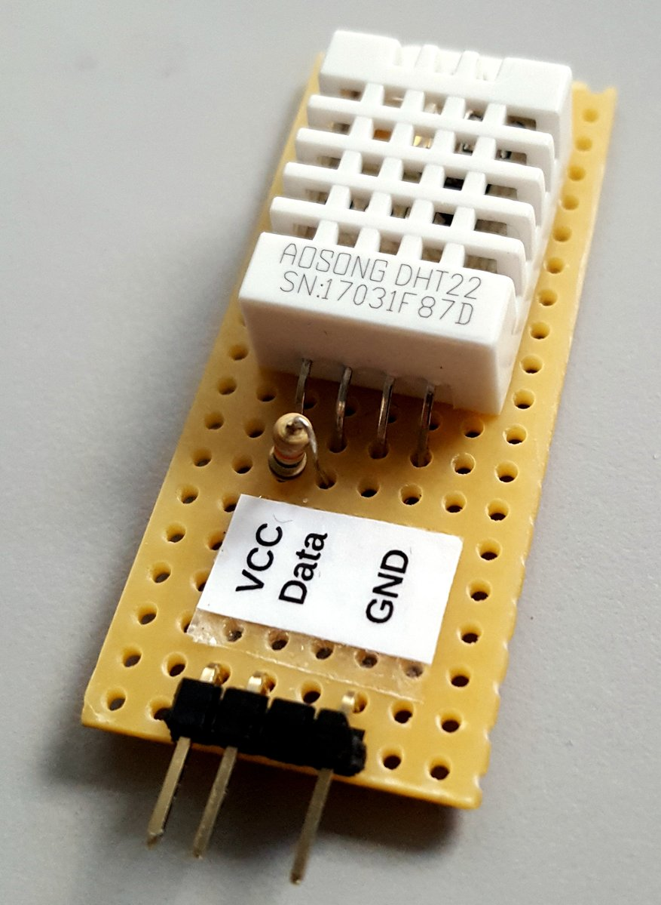

# Raspberry Pi - Twitter Api & Wetterdaten mit Kamerabild twittern

Die Anleitung auf: https://github.com/pediehl/raspberry-pi-twitter-api
muss ohne Probleme laufen. Dann erst kannst du hier beginnen.

## Material
+ Schaltdose (um den Sensor vor Regen etc. zu schützen)
+ fertigen DHT22-Sensor auf Platine
+ drei lange Kabel female-female
+ Camera-Module für Raspberry Pi

DHT22-Sensor auf einer Platine

### Ergebnis
